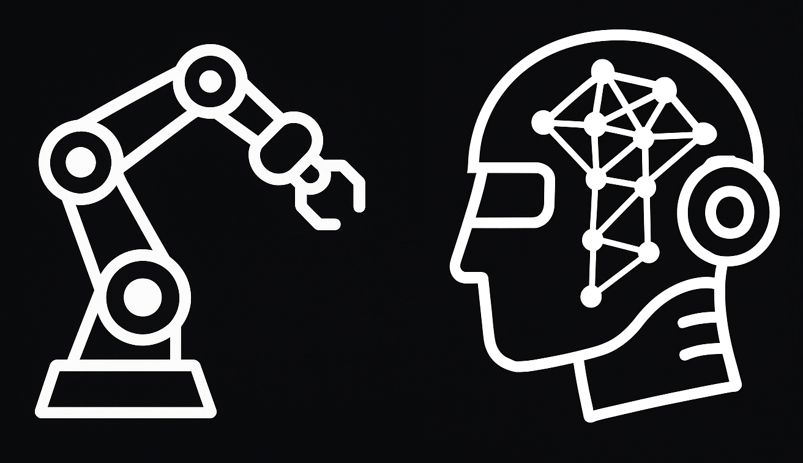

# **Mason Research Group Website**

A modern, responsive research group website showcasing AI and Machine Learning research at the School of Computer Science, University of Galway.



## **About**

The Mason Research Group focuses on developing new and effective Artificial Intelligence and Machine Learning algorithms and applying these algorithms to solve real-world problems. Our research is supported by funding from Research Ireland (Science Foundation Ireland, Irish Research Council), Enterprise Ireland, and the Royal Irish Academy.

**Website**: [Autonomous-Agents-Research.com](https://autonomous-agents-research.com)

## **Getting Started**

This website is built with [Next.js](https://nextjs.org) and requires Node.js v18.17+.

### **1. Clone the repository**

```bash
git clone <your-repository-url>
cd research-website
```

### **2. Install dependencies**

```bash
npm install
# or
yarn install
```

### **3. Run development server**

```bash
npm run dev
# or
yarn dev
```

Open [http://localhost:3000](http://localhost:3000) to view the website.

### **4. Build for production**

```bash
npm run build
npm start
# or
yarn build
yarn start
```

## **Configuration**

### **Edit Configuration**
```
src/app/resources/config.js
```

### **Edit Content**
```
src/app/resources/content.js
```

## **Features**

### **Research Projects**
- **AUV (Autonomous Underwater Vehicle)**: Marine exploration and robotics
- **Robotic Arm**: Advanced robotics and control systems
- **AI-PRINT**: AI-powered printing and manufacturing
- **EIRE AIAI**: AI and autonomous systems research
- **EvoMORS**: Evolutionary multi-objective robotics systems
- **Agent-Based Energy**: Decision making in the GB energy sector
- **Smart Buildings**: Reinforcement learning for building energy management
- **Solar Energy**: Deep learning applications in solar energy

### **News & Publications**
- Latest research updates and announcements
- Publication highlights and conference presentations
- Workshop organization and participation
- PhD defenses and academic achievements

### **Team Section**
- Research group members and collaborators
- Principal investigator profile
- Research team information

### **Design System**
- Custom design tokens and components
- Responsive layout optimized for all screen sizes
- Modern UI with smooth animations
- Endless customization options through CSS custom properties

### **SEO & Performance**
- Automatic open-graph and X image generation with next/og
- Automatic schema and metadata generation based on content
- Optimized images and responsive design
- Fast loading times and accessibility features

### **Content Management**
- Centralized content management through content.js
- Dynamic project pages with image galleries
- News filtering by category and year
- Responsive image handling with custom styling

## **Technology Stack**

- **Framework**: Next.js 14 with App Router
- **Language**: TypeScript
- **Styling**: SCSS Modules with custom design system
- **UI Components**: Custom component library (once-ui)
- **Content**: Static content management with JSX support
- **Deployment**: Vercel-ready with environment configuration

## **Project Structure**

```
src/
├── app/                    # Next.js App Router
│   ├── resources/         # Content and configuration
│   ├── utils/            # Utility functions
│   └── [pages]/          # Route pages
├── components/           # React components
│   ├── research/        # Research-specific components
│   ├── news/           # News components
│   └── team/           # Team components
└── once-ui/            # Custom UI component library
```

## **Deploy with Vercel**

[](https://vercel.com/new/clone?repository-url=<your-repo-url>&project-name=mason-research-group&repository-name=mason-research-group)

### **Environment Variables**

Set up the following environment variables for production:

```env
NEXT_PUBLIC_BASE_URL=your-domain.com
VERCEL_URL=your-vercel-url.vercel.app
```

## **Contributing**

1. Fork the repository
2. Create a feature branch (`git checkout -b feature/amazing-feature`)
3. Commit your changes (`git commit -m 'Add amazing feature'`)
4. Push to the branch (`git push origin feature/amazing-feature`)
5. Open a Pull Request

## **License**

This project is licensed under the MIT License - see the [LICENSE](LICENSE) file for details.

## **Contact**

- **Principal Investigator**: Karl Mason
- **Email**: [Contact via LinkedIn](https://www.linkedin.com/in/karl-mason-41581b8b/)
- **Institution**: School of Computer Science, University of Galway
- **Website**: [Autonomous-Agents-Research.com](https://autonomous-agents-research.com)
